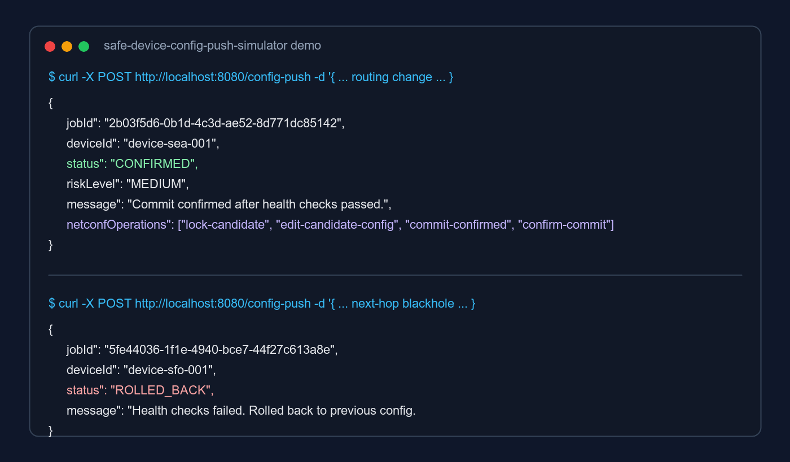

# Safe Device Config Push Simulator

[](https://github.com/yaminipriyakodeboyina/safe-device-config-push-simulator/actions/workflows/ci.yml)

Safe Device Config Push Simulator is a Java/Spring Boot backend service that simulates safe network device configuration deployment using NETCONF-style device operations, device locking, config diffing, risk classification, commit-confirmed rollout, health checks, rollback, and audit logging.

Recruiters should understand this project in 10 seconds: it is a miniature production-safe network automation system.

## Why It Exists

Network configuration changes are risky. A bad route, BGP policy, or delete command can break connectivity. This project models a safer rollout workflow:

1. Validate the config change
2. Lock the target device
3. Generate a readable diff
4. Classify risk
5. Simulate commit-confirmed
6. Run health checks
7. Confirm commit or rollback
8. Store audit history with the simulated NETCONF RPC transcript

## Architecture

```text
Client
  |
  v
Config Push API
  |
  v
Config Orchestrator
  |
  +--> Device Lock Manager
  +--> Simulated NETCONF Device Client
  +--> Config Diff Engine
  +--> Risk Classifier
  +--> Commit-Confirmed Simulator
  +--> Health Check Engine
  +--> Rollback Manager
  +--> Audit Log Store
```

## Tech Stack

- Java 15 compatible source
- Spring Boot REST APIs
- Simulated NETCONF client
- In-memory stores for jobs, device configs, and audit history
- JUnit + Spring MockMvc tests
- Docker

## NETCONF Simulation

The project does not need real routers to run locally. Instead, the orchestrator talks to a `DeviceConfigClient` interface with a simulated NETCONF implementation.

For every config push, the job records the NETCONF-style RPCs that would be sent to a network device:

```text
<lock> candidate
<get-config> running
<edit-config> candidate
<validate> candidate
<commit confirmed>
<commit> or <discard-changes>
<unlock> candidate
```

This keeps the project easy to run while still showing the real infrastructure workflow behind safe network automation.

## Demo



## API

### Submit a config push

```bash
curl -X POST http://localhost:8080/config-push \
  -H "Content-Type: application/json" \
  -d '{
    "deviceId": "device-sea-001",
    "configChange": "set routing-options static route 10.0.0.0/24 next-hop 192.168.1.1",
    "changeType": "routing"
  }'
```

Example response:

```json
{
  "jobId": "2b03f5d6-0b1d-4c3d-ae52-8d771dc85142",
  "deviceId": "device-sea-001",
  "status": "DEVICE_LOCKED",
  "riskLevel": null,
  "diff": null,
  "message": "Device locked. Safe config workflow started."
}
```

### Get job status

```bash
curl http://localhost:8080/config-push/{jobId}
```

Example completed response:

```json
{
  "jobId": "2b03f5d6-0b1d-4c3d-ae52-8d771dc85142",
  "deviceId": "device-sea-001",
  "status": "CONFIRMED",
  "riskLevel": "MEDIUM",
  "diff": "+ set routing-options static route 10.0.0.0/24 next-hop 192.168.1.1\n- set routing-options static route 10.0.0.0/24 next-hop 192.168.1.2",
  "message": "Commit confirmed after health checks passed.",
  "netconfOperations": [
    {
      "operation": "commit-confirmed",
      "rpc": "<rpc><commit><confirmed/><confirm-timeout>120</confirm-timeout></commit></rpc>",
      "executedAt": "2026-05-09T23:26:19Z"
    }
  ]
}
```

### View audit log

```bash
curl http://localhost:8080/audit-log
```

The audit log includes the old config, new config, diff, risk level, final status, timestamps, and simulated NETCONF operations.

## Device Locking

Only one config push can run per device at a time. If a second request targets a device with an active job, the API returns `409 Conflict`:

```json
{
  "code": "DEVICE_LOCKED",
  "message": "Device device-sea-001 already has a running config push."
}
```

This is the most important reliability feature in the project.

## Risk Rules

| Config change | Risk |
| --- | --- |
| `interfaces ... description` | `LOW` |
| `routing-options` | `MEDIUM` |
| `bgp` or `policy-options` | `HIGH` |
| `delete ...` | `HIGH` |

## Rollback Simulation

Health checks fail when a config change contains `blackhole` or `fail-health-check`. Delete operations are also treated conservatively when high risk.

Try a rollback:

```bash
curl -X POST http://localhost:8080/config-push \
  -H "Content-Type: application/json" \
  -d '{
    "deviceId": "device-sfo-001",
    "configChange": "set routing-options static route 0.0.0.0/0 next-hop blackhole",
    "changeType": "routing"
  }'
```

Expected final status: `ROLLED_BACK`.

## Run Locally

If Maven is installed:

```bash
mvn spring-boot:run
```

Run tests:

```bash
mvn test
```

## Run With Docker

```bash
docker build -t safe-device-config-push-simulator .
docker run -p 8080:8080 safe-device-config-push-simulator
```

## What This Demonstrates

- Backend API design
- Distributed-systems style locking
- NETCONF-style network device automation
- Network infrastructure domain knowledge
- Reliability-focused rollout and rollback design
- Testable Java service architecture
- Production automation thinking without requiring real network devices

## Resume Bullet

Built Safe Device Config Push Simulator, a Java/Spring Boot backend service that simulates NETCONF-style network device configuration deployment with per-device locking, config diffing, rule-based risk classification, commit-confirmed rollout, automated health checks, rollback, and audit logging.
